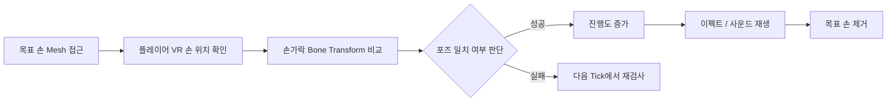
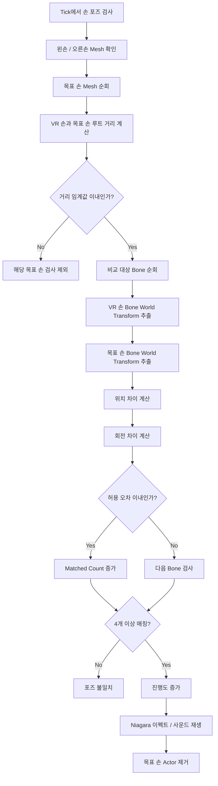

# ChicaHeroes

> **Unreal Engine 기반 Meta Quest 2 VR 게임 프로젝트**  
> VR 환경에서 무기 상호작용, 손 포즈 매칭, UI 시스템, 렌더링 최적화를 구현한 치과 테마 VR 게임입니다.

<br/>

<p align="center">
  
</p>
[시연 영상 바로가기](https://drive.google.com/file/d/1lrQPeGNyuywvUe0D9Lphy_OvQVLF38Ro/view?usp=drive_link)
<br/>


<br/>

---

## 목차

- [프로젝트 소개](#프로젝트-소개)
- [프로젝트 정보](#프로젝트-정보)
- [담당 구현 요약](#담당-구현-요약)
- [핵심 기여 부분](#핵심-기여-부분)
- [1. 손 포즈 매칭 시스템 개선](#1-손-포즈-매칭-시스템-개선)
- [2. Quest 2 VR 렌더링 최적화](#2-quest-2-vr-렌더링-최적화)
- [프로젝트를 통해 배운 점](#프로젝트를-통해-배운-점)
- [핵심 성과](#핵심-성과)
- [License](#license)

<br/>

---
## 프로젝트 소개
<p align="center">
  
</p>

**ChicaHeroes**는 Meta Quest 2 환경을 대상으로 제작한 **Unreal Engine 기반 VR 미니게임 프로젝트**입니다.  
플레이어는 VR 공간 안에서 세균을 제거하고, 스케일링을 진행하며, 발치와 같은 치과 치료 방식의 미니게임을 체험합니다.

이 프로젝트에서는 단순한 VR 체험 구현에 그치지 않고, 실제 VR 게임 클라이언트에서 필요한 입력 처리, 손 포즈 판정, UI 상호작용, 이펙트 처리, 렌더링 최적화까지 직접 구현하는 데 중점을 두었습니다.

특히 사용자의 VR 손과 목표 손 Skeletal Mesh를 비교하는 **손 포즈 매칭 시스템**과, Meta Quest 2 환경을 고려한 **Draw Call 최적화**를 주요 개선 과제로 다뤘습니다.
<br/>

---
## 프로젝트 정보
<table>
  <tr>
    <td width="30%" valign="top">
      <h3>프로젝트 정보</h3>
      <table>
        <tr>
          <th align="left">항목</th>
          <th align="left">내용</th>
        </tr>
        <tr>
          <td>프로젝트명</td>
          <td>ChicaHeroes</td>
        </tr>
        <tr>
          <td>장르</td>
          <td>VR 미니게임 / 액션</td>
        </tr>
        <tr>
          <td>플랫폼</td>
          <td>Meta Quest 2</td>
        </tr>
        <tr>
          <td>엔진</td>
          <td>Unreal Engine</td>
        </tr>
        <tr>
          <td>언어</td>
          <td>C++ / Blueprint</td>
        </tr>
        <tr>
          <td>담당 역할</td>
          <td>VR 클라이언트 개발</td>
        </tr>
        <tr>
          <td>주요 구현</td>
          <td>
            VR 무기 상호작용<br/>
            손 포즈 매칭 시스템<br/>
            UI 시스템<br/>
            Draw Call 최적화
          </td>
        </tr>
      </table>
    </td>
    <td width="62%" valign="top">
      <h3>프로젝트 흐름</h3>
      
    </td>
  </tr>
</table>

<br/>
<br/>

---

## 담당 구현 요약

| 구분 | 구현 내용 |
|---|---|
| VR 무기 상호작용 | Grab 기반 무기 장착, 발사 입력, 탄환 이동 및 충돌 처리 |
| 손 포즈 매칭 | VR 손 Skeletal Mesh와 목표 손 Mesh의 Bone Transform 비교 |
| UI 시스템 | 무기 교체 UI, 상점 UI, NPC 대화 UI 구현 |
| 피드백 처리 | Niagara 이펙트, 사운드, 진행도 UI 연동 |
| 렌더링 최적화 | Cull Distance, Material Slot 확인, Merge Actors를 통한 Draw Call 감소 |

<br/>

---

## 핵심 기여 부분

<table>
  <tr>
    <td align="center" width="50%">
      <b>VR 전투 화면</b><br/>
      <sub>무기 Grab 및 발사 상호작용</sub>
    </td>
    <td align="center" width="50%">
      <b>손 포즈 매칭 미니게임</b><br/>
      <sub>VR 손과 목표 손 포즈 비교</sub>
    </td>
  </tr>
  <tr>
    <td>
      
    </td>
    <td>
      
    </td>
  </tr>
</table>

<br/>

<table>
  <tr>
    <td align="center" width="33%">
      <b>무기 UI</b><br/>
      <sub>무기 선택 및 교체</sub>
    </td>
    <td align="center" width="33%">
      <b>상점 UI</b><br/>
      <sub>골드 기반 구매 처리</sub>
    </td>
    <td align="center" width="33%">
      <b>NPC 대화 UI</b><br/>
      <sub>공통 데이터 기반 출력</sub>
    </td>
  </tr>
  <tr>
    <td>
      
    </td>
    <td>
      
    </td>
    <td>
      
    </td>
  </tr>
</table>

<br/>

---

# 1. 손 포즈 매칭 시스템 개선

## 1-1. 구현 목표

손 포즈 매칭 미니게임에서는 플레이어의 VR 손 포즈와 날아오는 목표 손 Skeletal Mesh의 포즈를 비교해야 했습니다.  
사용자가 목표 손과 유사한 손 모양을 만들고 실제 공간상에서 가까이 맞추면, 진행도가 증가하고 이펙트와 사운드가 재생되는 구조를 목표로 했습니다.

<br/>



<br/>

---

## 1-2. 초기 문제 상황

초기 구현에서는, 포즈 매칭을 위해 손모양의 스켈레탈 메시에 설정한 Physics Asset의 BodyInstance Transform을 기준으로 손가락 Bone의 위치와 회전을 비교했습니다.  
하지만 실제로 비슷한 손 포즈를 취해도 매칭되는 Bone이 거의 검출되지 않는 문제가 발생했습니다.

<br/>

```text
예상 동작
- 플레이어 손과 목표 손의 포즈가 유사하면 Match Count 증가

실제 문제
- 비슷한 포즈를 취해도 위치 차이와 회전 차이가 크게 발생
- 6개 Bone 중 매칭되는 Bone이 거의 없음
- 결과적으로 손 포즈 판정이 정상적으로 동작하지 않음
```

<br/>

<table>
  <tr>
    <td align="center" width="50%">
      <b>스테이지 화면</b><br/>
      <sub> </sub>
    </td>
    <td align="center" width="50%">
      <b>문제 상황</b><br/>
      <sub>유사한 포즈에서도 매칭 실패</sub>
    </td>
  </tr>
  <tr>
    <td>
      
    </td>
    <td>
      
    </td>
  </tr>
</table>

<br/>

---

## 1-3. 디버깅 과정

문제 원인을 확인하기 위해 비교 대상 Bone마다 위치 차이와 회전 차이를 로그로 출력했습니다.


<br/>

```cpp
LogTemp:   index_03_l   PosDiff: 105.27  RotDiff: 57.40
LogTemp:   middle_03_l  PosDiff: 112.84  RotDiff: 53.11
LogTemp:   ring_03_l    PosDiff: 108.52  RotDiff: 49.86
LogTemp:   pinky_03_l   PosDiff: 101.39  RotDiff: 51.22
LogTemp:   thumb_03_l   PosDiff: 96.41   RotDiff: 45.70

Matched Bone: 0 / 6
```

<br/>

로그를 확인한 결과, 화면상으로는 손 모양이 비슷해 보여도 Bone 간 위치 차이가 100 이상, 회전 차이가 50도 이상 발생하는 것을 확인했습니다.  
이를 통해 단순한 허용 오차 문제가 아니라, **비교에 사용한 Transform 기준 자체가 적절하지 않을 가능성**이 있다고 판단했습니다.

<br/>

---

## 1-4. 시도했던 방법과 한계

처음에는 World Transform 기준 비교에서 발생하는 차이를 줄이기 위해 Local Transform 비교를 시도했습니다.  
Local Transform은 손가락의 상대적인 모양을 비교하기에는 유리했지만, VR 공간에서 실제로 목표 손과 가까운 위치에 있는지는 판단하기 어려웠습니다.

<br/>

| 시도 | 장점 | 한계 |
|---|---|---|
| Physics Body Transform 비교 | 물리 Body 기준으로 비교 가능 | 애니메이션 / 트래킹 상태를 정확히 반영하지 못함 |
| Local Transform 비교 | 손가락의 상대적인 모양 비교에 유리 | 손이 목표 위치에 없어도 포즈만 비슷하면 매칭될 수 있음 |
| World Bone Transform 비교 | 실제 월드 공간의 Bone 위치와 회전 비교 가능 | 거리 필터와 허용 오차 설계가 필요 |

<br/>

Local Transform만 사용할 경우, 플레이어의 손이 목표 손과 실제로 닿지 않아도 손 모양만 비슷하면 성공으로 판정될 수 있었습니다.  
따라서 포즈의 유사도뿐만 아니라 **VR 공간상에서 실제로 손이 목표와 가까운지** 함께 판단해야 했습니다.

<br/>

---

## 1-5. 원인 분석

초기 구현에서 사용한 Physics Asset 기반 Transform은 실제 Skeletal Mesh의 현재 Bone Transform과 다르게 동작할 수 있었습니다.  
특히 물리 시뮬레이션을 사용하지 않는 상태에서는 BodyInstance Transform이 현재 애니메이션 또는 VR 트래킹 상태를 정확하게 반영하지 못할 수 있다고 판단했습니다.

따라서 손 포즈 판정에는 Physics Body Transform이 아니라, 실제 Skeletal Mesh의 Bone Transform을 직접 가져와 비교하는 방식이 더 적합했습니다.

<br/>

```text
문제 원인
- Physics Asset BodyInstance 기준 Transform 사용
- 실제 손 Skeletal Mesh의 Bone Transform과 기준이 다름
- Simulate Physics가 꺼진 상태에서 BodyInstance가 현재 포즈를 정확히 반영하지 못함
- 결과적으로 유사한 포즈에서도 위치 / 회전 차이가 크게 발생
```

<br/>

---

## 1-6. 해결 방법

최종적으로 `USkeletalMeshComponent::GetSocketTransform()`을 사용하여 VR 손과 목표 손의 Bone World Transform을 직접 비교하는 방식으로 개선했습니다.

또한 손가락 Bone을 비교하기 전에 먼저 VR 손 Mesh와 목표 손 Mesh의 루트 거리를 검사했습니다.  
이를 통해 손이 실제로 목표 손과 가까운 경우에만 포즈 비교를 수행하도록 구성했습니다.

<br/>

### 개선된 매칭 흐름



<br/>

---

## 1-7. 핵심 구현 코드

### 비교 대상 Bone 정의

왼손과 오른손 각각 6개의 주요 Bone을 비교 대상으로 설정했습니다.

```cpp
BoneNamesToCompare_l = {
    FName("index_03_l"),
    FName("middle_03_l"),
    FName("ring_03_l"),
    FName("pinky_03_l"),
    FName("thumb_03_l"),
    FName("middle_metacarpal_l")
};

BoneNamesToCompare_r = {
    FName("index_03_r"),
    FName("middle_03_r"),
    FName("ring_03_r"),
    FName("pinky_03_r"),
    FName("thumb_03_r"),
    FName("middle_metacarpal_r")
};
```

<br/>

### VR 손 Mesh 자동 할당

`BeginPlay()`에서 플레이어 Pawn의 Skeletal Mesh Component를 순회하며 왼손과 오른손 Mesh를 자동으로 할당했습니다.

```cpp
for (TActorIterator<APawn> It(GetWorld()); It; ++It)
{
    TArray<USkeletalMeshComponent*> Meshes;
    It->GetComponents(Meshes);

    for (auto* Mesh : Meshes)
    {
        if (Mesh)
        {
            if (Mesh->GetName().Contains(TEXT("HandLeft")))
            {
                VRHandMesh_L = Mesh;
            }
            else if (Mesh->GetName().Contains(TEXT("HandRight")))
            {
                VRHandMesh_R = Mesh;
            }
        }
    }
}
```

<br/>

### 루트 거리 검사

포즈 비교 전에 VR 손과 목표 손 Mesh의 거리를 먼저 확인했습니다.  
이를 통해 손 모양만 비슷한 상태에서 발생할 수 있는 오검출을 줄였습니다.

```cpp
const float Dist = FVector::Dist(
    Hand.HandMesh->GetComponentLocation(),
    SpawnedMesh->GetComponentLocation()
);

if (Dist > MatchingDistanceThreshold)
{
    continue;
}
```

<br/>

### Bone World Transform 비교

`GetSocketTransform(Bone, RTS_World)`를 사용하여 실제 Skeletal Mesh의 Bone World Transform을 가져오고, 위치 차이와 회전 차이를 계산했습니다.

```cpp
int32 MatchedCount = 0;

for (const FName& Bone : Hand.BoneList)
{
    const FTransform VRBoneWorld =
        Hand.HandMesh->GetSocketTransform(Bone, RTS_World);

    const FTransform SpawnedBoneWorld =
        SpawnedMesh->GetSocketTransform(Bone, RTS_World);

    const float PosDiff =
        FVector::Dist(
            VRBoneWorld.GetLocation(),
            SpawnedBoneWorld.GetLocation()
        );

    const float RotDiff =
        VRBoneWorld.GetRotation().AngularDistance(
            SpawnedBoneWorld.GetRotation()
        ) * (180.f / PI);

    if (PosDiff <= PositionTolerance && RotDiff <= RotationTolerance)
    {
        MatchedCount++;
    }
}
```

<br/>

### 매칭 성공 처리

6개의 주요 Bone 중 4개 이상이 허용 오차 안에 들어오면 성공으로 판정했습니다.  
성공 시 진행도를 증가시키고, Niagara 이펙트와 사운드를 재생한 뒤 목표 손 Actor를 제거했습니다.

```cpp
if (MatchedCount >= 4)
{
    bAnyMatch = true;

    if (ToothProgressActor)
    {
        ToothProgressActor->OnProgressUpdated(Progress);
    }

    if (RotatingActor)
    {
        RotatingActor->OnProgressUpdate_Rot(Progress);
    }

    if (RotatingActor2)
    {
        RotatingActor2->OnProgressUpdate_Rot(Progress);
    }

    if (MatchingEffect)
    {
        Progress += 5.0f;

        UNiagaraFunctionLibrary::SpawnSystemAtLocation(
            GetWorld(),
            MatchingEffect,
            SpawnedMesh->GetComponentLocation(),
            FRotator::ZeroRotator
        );

        if (MatchingSound)
        {
            UGameplayStatics::PlaySoundAtLocation(
                GetWorld(),
                MatchingSound,
                SpawnedMesh->GetComponentLocation()
            );
        }
    }

    Tooth.Actor->Destroy();
    Tooth.Actor = nullptr;
    Hand.SplineActor->SpawnedTeeth.RemoveAt(i);
}
```

<br/>

---

## 1-8. 개선 결과

개선 후에는 VR 손과 목표 손이 실제로 가까운 위치에 있을 때만 포즈 비교를 수행하도록 변경되었습니다.  
또한 Physics Asset 기준이 아닌 Skeletal Mesh Bone World Transform을 사용하면서, 실제 사용자의 손 추적 상태를 기준으로 포즈를 판정할 수 있게 되었습니다.

<br/>

| 개선 항목 | 내용 |
|---|---|
| Transform 기준 변경 | Physics Body Transform → Skeletal Mesh Bone World Transform |
| 오검출 방지 | 루트 거리 검사 추가 |
| 비교 대상 | 왼손 / 오른손 각각 6개 주요 Bone |
| 성공 조건 | 6개 Bone 중 4개 이상 일치 |
| 피드백 | 진행도 증가, Niagara 이펙트, 사운드 재생 |
| 결과 처리 | 매칭 성공 시 목표 손 Actor 제거 |

<br/>
<br/>

---

# 2. Quest 2 VR 렌더링 최적화

## 2-1. 최적화 배경

ChicaHeroes는 Meta Quest 2 환경에서 실행되는 VR 프로젝트이기 때문에, PC 환경보다 렌더링 비용에 더 민감했습니다.  
특히 VR은 양안 렌더링 특성상 Draw Call, Static Mesh 수, Material Slot 수, 실시간 조명 수가 성능에 직접적인 영향을 줄 수 있습니다.

따라서 단순히 기능을 구현하는 것에서 끝내지 않고, Quest 2 환경에서 안정적으로 실행될 수 있도록 렌더링 비용을 분석하고 최적화를 진행했습니다.

프레임 예산 기준은 Meta에서 제공해주는 문서를 확인하였을 때 적정FPS는 72 FPS이므로 예산을 13.89 ms(1000 / 72) 프레임 타임으로 기준을 잡았습니다. 
또한 드로우콜의 목표치도 200~300대를 유지할 수 있도록 기준치를 잡았습니다.


\
출처 : (https://developers.meta.com/horizon/documentation/unreal/unreal-debug-android/)
<br/>

---

## 2-2. 프로파일링

최적화 전 `stat unit`, `stat game`, `stat scenerendering`을 활용해 병목 지점을 확인했습니다.

<br/>

<table>
  <tr>
    <td align="center" width="50%">
      <b>Stat Unit</b><br/>
      <sub>Frame / Game / Draw / GPU 시간 확인</sub>
    </td>
    <td align="center" width="50%">
      <b>Stat SceneRendering</b><br/>
      <sub>Draw Call 및 렌더링 지표 확인</sub>
    </td>
  </tr>
  <tr>
    <td>
      
    </td>
    <td>
      
    </td>
  </tr>
</table>

<br/>

### 초기 측정값

| 항목 | 측정값 |
|---|---:|
| Frame | 9.39 ms |
| Game | 7.76 ms |
| Draw | 3.38 ms |
| GPU | 1.47 ms |
| Draw Calls | 517 |
| Primitives | 79.9K |
| Mesh Draw Calls | 100 |
| Lights in Scene | 13 |
| Memory | 2.07 GB |

<br/>

`stat game`에서 World Tick Time과 Tick Time이 상대적으로 낮게 측정되었기 때문에,  
게임 로직보다 렌더링 리소스 관리와 Draw Call 감소를 우선 최적화 대상으로 설정했습니다.

<br/>

---

## 2-3. 최적화 방향

최적화는 전체 오브젝트를 무작정 병합하는 방식이 아니라, VR 시야와 상호작용 여부를 기준으로 적용했습니다.

<br/>

| 최적화 항목 | 적용 방향 |
|---|---|
| Cull Distance | 거리에 따라 불필요한 Static Mesh 렌더링 제외 |
| Material Slot 확인 | 불필요한 Material Slot로 인한 Draw Call 증가 여부 확인 |
| Merge Actors | 정적인 배경 Mesh를 구역 단위로 병합 |
| 상호작용 오브젝트 제외 | 플레이어가 잡거나 충돌해야 하는 오브젝트는 병합 제외 |
| Culling 효율 유지 | 전체 맵 병합이 아닌 구역 단위 병합 적용 |

<br/>

---

## 2-4. 1차 개선: Cull Distance 적용

먼저 Property Matrix를 활용해 여러 Static Mesh에 Cull Distance를 일괄 적용했습니다.

<br/>

```text
작은 오브젝트          : 1000
중간 크기 오브젝트     : 2000 ~ 2500
큰 건물 / 주요 구조물  : Cull Distance 적용 제외
```

<br/>

Cull Distance 적용 후, 일정 거리 밖의 작은 오브젝트가 렌더링 대상에서 제외되면서 Draw Call이 감소했습니다.

<br/>

| 단계 | Draw Calls |
|---|---:|
| 최적화 전 | 517 |
| Cull Distance 적용 후 | 460 |

<br/>

---

## 2-5. 2차 개선: Merge Actors 적용

다음으로 정적인 배경 건물과 장식 Mesh를 중심으로 Merge Actors를 적용했습니다.  
모든 오브젝트를 하나로 병합하면 오히려 Culling 효율이 떨어질 수 있기 때문에, 플레이어 이동 범위와 시야를 고려하여 구역 단위로 병합했습니다.

<br/>

```text
Merge 대상
- 정적인 배경 건물
- 장식용 Static Mesh
- 상호작용하지 않는 오브젝트

Merge 제외 대상
- 플레이어가 잡는 무기
- 충돌 / 상호작용이 필요한 오브젝트
- 개별 Visibility 제어가 필요한 오브젝트
```

<br/>

---

## 2-6. 최적화 결과

Cull Distance와 Merge Actors를 적용한 결과, Draw Call을 517에서 213까지 줄였습니다.  
이는 약 59% 감소에 해당하며, Quest 2 VR 환경에서 렌더링 부담을 줄이는 데 기여했습니다.

<br/>

| 단계 | Draw Calls | 감소율 |
|---|---:|---:|
| 최적화 전 | 517 | - |
| Cull Distance 적용 후 | 460 | 약 11% 감소 |
| Merge Actors 적용 후 | 213 | 약 59% 감소 |

<br/>

<table>
  <tr>
    <td align="center" width="50%">
      <b>최적화 전</b><br/>
      <sub>Draw Calls 517</sub>
    </td>
    <td align="center" width="50%">
      <b>최적화 후</b><br/>
      <sub>Draw Calls 213</sub>
    </td>
  </tr>
  <tr>
    <td>
      
    </td>
    <td>
      
    </td>
  </tr>
</table>

<br/>

---

# 프로젝트를 통해 배운 점

이 프로젝트를 통해 VR 클라이언트 개발에서는 단순히 기능이 동작하는 것뿐 아니라, 사용자의 실제 움직임, 입력 타이밍, 공간상의 위치, 렌더링 비용까지 함께 고려해야 한다는 점을 경험했습니다.

손 포즈 매칭 시스템을 개선하면서, 같은 Transform 비교처럼 보여도 Physics Asset 기준인지, Skeletal Mesh Bone 기준인지에 따라 결과가 크게 달라질 수 있다는 것을 확인했습니다.  
특히 VR 환경에서는 화면상으로 비슷해 보이는 포즈라도 Transform 기준이 잘못되면 판정 결과가 크게 달라질 수 있기 때문에, 디버그 로그를 통해 위치 차이와 회전 차이를 직접 확인하며 원인을 추적하는 과정이 중요했습니다.

또한 Quest 2 최적화 과정에서는 Draw Call, Material Slot, Static Mesh 수처럼 개별적으로는 작아 보이는 요소들이 VR 환경에서 큰 성능 차이를 만들 수 있다는 것을 배웠습니다.  
이를 통해 기능 구현뿐 아니라, 실제 타깃 디바이스에서 실행 가능한 수준으로 리소스를 관리하는 경험을 쌓을 수 있었습니다.

<br/>

---

# 핵심 성과

| 항목 | 결과 |
|---|---|
| 손 포즈 매칭 | Bone World Transform 기반 비교로 판정 안정성 개선 |
| 포즈 판정 기준 | 6개 주요 Bone 중 4개 이상 일치 시 성공 |
| 오검출 방지 | 루트 거리 검사 추가 |
| 진행도 연동 | 매칭 성공 시 진행도 증가, 이펙트 및 사운드 재생 |
| Draw Call 최적화 | 517 → 213 |
| 최적화 효과 | 약 59% 감소 |
| UI 구조 | 무기, 상점, NPC UI를 데이터 및 인덱스 기반으로 관리 |

<br/>

---

# License

본 프로젝트는 포트폴리오 목적으로 정리되었습니다.
